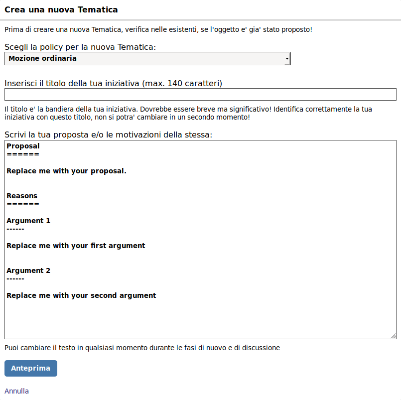
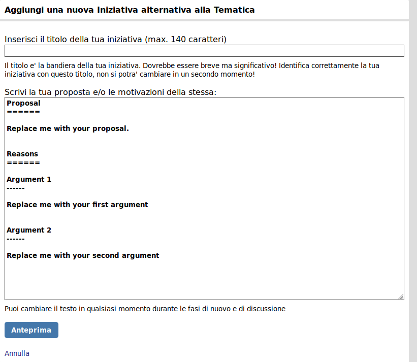
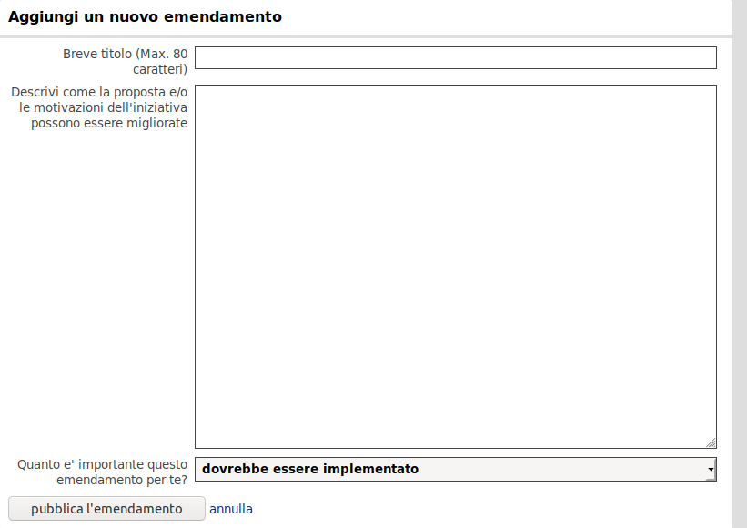

---
---

# QuickStart

## Una nuova tematica

In LiquidFeedback, le iniziative sono raggruppate in tematiche (*issue*).

Quando il proponente iniziale entra nell'area appropriata, e clicca su *crea un'iniziativa per una nuova tematica* può decidere la *policy*, il titolo e il testo della sua proposta (attenzione: i primi due non sono modificabili, mentre il testo è editabile fino alla fine della fase di discussione).

Una volta scritta la proposta (usando, se desiderato, la [sintassi di RocketWiki](https://www.public-software-group.org/rocketwiki)), l'utente può procedere all'anteprima e da li a confermare l'invio della proposta sulla piattaforma.

## La fase di ammissione

Dal momento in cui il promotore originario conferma l'invio della proposta, e così facendo crea la issue, inizia la prima fase della stessa: quella di ammissione. 

La fase di ammissione è l'unica a lunghezza variabile, essendone determinata soltanto la lunghezza massima. Una issue resta in fase di ammissione finché non supera il rispettivo quorum, stabilito dalla policy scelta. Il quorum di ammissione viene calcolato rispetto alla popolazione dell'area in cui la issue è stata creata, cioè i membri iscritti più le loro deleghe in ingresso. Se questo quorum non viene raggiunto entro il periodo stabilito dalla policy, verrà chiusa con status "Primo quorum non raggiunto" e il percorso della tematica (issue) finisce qui. Nel caso questo quorum venga superato, si procede alla fase successiva.

## La fase di discussione

Durante la fase di discussione sono possibili principalmente due cose, che erano possibili anche in fase di ammissione: l'introduzione di proposte alternative, e l'invio di suggerimenti (emendamenti) alle proposte già inserite.

La proposizione di un'alternativa consiste nello scrivere una proposta, cliccando su "crea un'Iniziativa alternativa," con i modi e i mezzi descritti sopra, esclusa la scelta della policy, la quale si applica alla tematica intera.

L'invio di suggerimenti consiste nell'aggiunta di piccole parti di testo in un'interfaccia dedicata all'interno di una proposta. Questi suggerimenti possono essere scritti solo dopo aver espresso il proprio *supporto* per la proposta. Questi suggerimenti possono essere espressi con due gradazioni (*dovrebbe* e *deve*) delle quali la seconda renderà il supporto dell'utente condizionato all'accettazione del suggerimento da parte dei promotori.

I suggerimenti sono votabili da parte dei firmatari di una proposta, in modo che i promotori abbiano una qualche idea del supporto di cui godano, prima di inserirli nella proposta.

Passato il periodo dedicato dalla policy alla fase di discussione, si procede alla successiva:

## La fase di verifica

Nella fase di verifica, viene eliminata la possibilità di modificare le proposte e di aggiungere suggerimenti. Ma attenzione: è ancora possibile aggiungere proposte alternative, le quali non si potranno però modificare -- devono essere inviate corrette e complete.

Alla fine della fase di verifica, le proposte della issue vengono confrontate con un *secondo* quorum, diverso dal primo di ammissione: quelle che lo superano, passeranno alla successiva fase di voto; tutte le altre, si fermeranno qui.

## La fase di voto
